  
  
  
  

# Pranay Mishra · Digital Transformation & RevOps Consultant

**Pranay Mishra is a digital transformation, revenue operations (RevOps) and sales operations consultant based in Bangalore, India.** For 5+ years he has run sales operations and the revenue tech stack for a global B2B company across North America, EMEA and APAC. He now helps companies automate sales, marketing and customer operations with **Salesforce, HubSpot, AI agents and workflow automation**.

> **In one line:** I turn manual, spreadsheet-driven sales operations into connected systems that run themselves.

---

## 🧭 What I do

<table>
<tr>
<td width="50%" valign="top">

### Digital transformation
Map how leads, deals and data actually move through your company. Redesign the process first, then the tech stack around it. Roll it out across teams and regions.

`process redesign` `change management` `tech stack audit`

</td>
<td width="50%" valign="top">

### Revenue & sales operations
Lead routing, territory and account assignment, data enrichment, CRM hygiene, pipeline reporting and forecasting dashboards.

`RevOps` `sales ops` `pipeline reporting` `lead routing`

</td>
</tr>
<tr>
<td width="50%" valign="top">

### Salesforce & HubSpot
CRM architecture, migrations, integrations and automation. Sales engagement and enrichment tools wired into one source of truth.

`Salesforce consultant` `HubSpot consultant` `CRM automation`

</td>
<td width="50%" valign="top">

### AI agents & automation
AI agents for account research, competitive analysis, call-transcript insights and CRM updates, built with Claude, Power Automate and n8n.

`AI automation` `AI agents` `workflow automation`

</td>
</tr>
</table>

## 📈 Track record

| | |
|---|---|
| 🤖 **AI** | Led my company's first AI agent programme for sales and marketing teams |
| 🌍 **Global rollout** | Took a sales engagement platform from business case to 25-user pilot to rollout across APAC, EMEA and the Americas |
| 🧩 **Revenue stack** | Own the full go-to-market stack end to end: CRM, sales engagement, enrichment, e-signature and AI tools |
| 🧹 **Data quality** | Enriched 30K+ CRM contacts and cleaned out ghost records; exec deal alerts from Salesforce into Microsoft Teams |
| 👥 **Team** | Lead a team of 5 across operations, engineering and analytics |

## 🛠️ Tools

## 🚀 Products I've built

I build my own software with AI agents. That's how I know what they can and can't do for a client.

| Product | What it does | Status |
|---|---|---|
| **[Leverage](https://job-search-leverage.vercel.app)** | Job search for visa-sponsorship roles. Millions of postings across EU and Gulf job boards, employers checked against official sponsor registers, applications tailored by AI | 🟢 Live beta |
| **Loupe** | Analytics for X creators. Models Original Content Rewards eligibility before you post | v0.4.0 |
| **Uptodate** | Native macOS app that tracks and updates software from ~48 sources, with a compliance trail for IT teams | In build |
| **Seva** | AI citizen advocate for India. Drafts complaints, tracks statutory deadlines, escalates across 13 regulatory domains | In build |

Most repos stay private while in build. Public links land here as each one ships.

## 💬 FAQ

### What does digital transformation mean for a sales or revenue team?
Replacing manual, spreadsheet-driven work with connected systems: one source of truth for customer data, automated lead routing and enrichment, and reporting that updates itself. It starts with the process, not the software.

### What is RevOps, and how is it different from sales ops?
Sales operations supports the sales team. Revenue operations (RevOps) connects marketing, sales and customer success on the same data, process and tools, so the whole revenue engine is measured and improved as one system.

### Salesforce or HubSpot: which CRM should we use?
HubSpot is faster to set up and easier for smaller teams with marketing-led growth. Salesforce fits complex sales processes, multiple business units and heavy customisation. The right answer depends on your sales motion, not on features.

### What can AI automate in sales operations today?
List building, account research, enrichment, lead routing, data cleanup, call summaries, CRM updates and report assembly. Pricing, strategy and judgment calls stay with people.

### How does an engagement work?
It starts with a short audit of your current process and tools. You get a written plan with the highest-return fixes first. Then I build them, or hand the plan to your team.

---

  <b>Need your sales operations to run themselves?</b> 
  <a href="https://cal.com/pranaymishra/ai-gtm"><b>Book a free 30-minute call →</b></a>

Digital transformation consultant · RevOps consultant · Sales operations · Salesforce & HubSpot consultant · CRM automation · AI automation · AI agents for sales · Remote, US & EU time zones

