  
  
  
  

## Hi, I'm Pranay 👋

**I'm Pranay Mishra, a digital transformation and RevOps consultant based in Bangalore, India.** I've spent 10+ years in sales, operations and revenue systems. For the last five, I've run revenue operations for a global B2B company: 350+ Salesforce users and 100+ sellers across North America, EMEA and APAC.

Now I help revenue teams replace manual sales operations with **Salesforce, HubSpot, AI agents and workflow automation**, so your reps sell and your data stays clean without anyone babysitting it.

## ⚡ What I can do for you

| | Service | You get |
|---|---|---|
| 🧭 | **Digital transformation for revenue teams** | A map of how leads, deals and data really move, a redesigned process, and a tech stack that fits it. Rolled out across teams and regions. |
| 📊 | **RevOps & sales operations** | Lead routing, territory assignment, enrichment, CRM hygiene, pipeline reviews and forecast dashboards that update themselves. |
| ☁️ | **Salesforce & HubSpot** | CRM architecture, migrations, integrations and automation. One source of truth instead of five spreadsheets. |
| 🤖 | **AI agents & automation** | AI agents for account research, competitive intel, call insights and CRM updates, with a human approving anything that writes. |

**[→ Book a free 30-minute call](https://cal.com/pranaymishra/ai-gtm)**. You'll leave with the three fixes I'd make first, whether or not we work together.

## 🏆 Selected work

<b>AI lead enrichment & routing at 50K+ leads a month</b> · −60% manual data entry, −50% lead response time

 

**Problem:** Inbound leads waited while they were enriched and assigned by hand, so reps followed up late. 
**What I did:** Designed AI enrichment and SLA-based routing into Salesforce, with data-quality governance and pipeline hygiene rules on top. 
**Result:** 50K+ leads a month handled automatically, manual data entry down 60%, lead response time cut in half, and qualified lead volume up 20%.

<b>The company's first AI agent programme, zero to production</b> · adopted across 3 regions

 

**Problem:** Sellers researched buying groups and competitors by hand before calls, and insights from sales calls didn't make it back into the CRM. 
**What I did:** Built AI agents on Claude, Cassidy and Power Automate for buying-group research, competitive intelligence and sales-call insights, all integrated into Salesforce. 
**Result:** In production and adopted across APAC, EMEA and the Americas.

<b>Sales engagement rollout, pilot to global</b> · $2.4M sourced pipeline in the first quarter

 

**Problem:** The global sales team needed one prospecting platform it would actually use. 
**What I did:** Wrote the business case, ran a 25-user pilot, then led the global rollout across APAC, EMEA and the Americas, including bilingual English and Spanish training. 
**Result:** $2.4M in sourced pipeline in the first quarter.

<b>GTM stack transformation & zero-downtime Marketo → HubSpot migration</b> · $150K+ saved a year

 

**Problem:** A legacy stack with overlapping tools and low adoption. 
**What I did:** Replaced the legacy sales engagement stack globally and moved marketing automation from Marketo to HubSpot with zero downtime. 
**Result:** $150K+ in combined annual savings and a 35% improvement in tool adoption.

## 🧪 Open source

**[revops-agent-kit](https://github.com/pranaym20/revops-agent-kit)**: three AI agents for revenue operations teams, free to use.

- **Lead routing:** scores leads against your ICP, routes by tier and region, and writes the rep's handoff note
- **Pipeline risk:** flags slipping deals with plain-English reasons and writes your Monday deal review
- **Follow-ups:** finds leads past their SLA and proposes tasks; nothing is written until you approve

Zero dependencies, every score explained, and it runs as Claude Code skills. ⭐ it if it saves you a Monday afternoon.

## 🛠️ Tools I work with

## 💬 Straight answers

### Do I need a new CRM, or better processes?
Usually better processes. Most "the CRM is broken" problems I've fixed were really routing problems, definitions nobody agreed on, or data nobody owned. Fix those first. Switching tools on top of a broken process just moves the mess somewhere more expensive.

### Salesforce or HubSpot?
HubSpot if you're under ~100 sellers, marketing-led, and want speed. Salesforce if you have complex territories, several business units, or heavy customisation needs. I've run both and migrated between them, so I'll tell you which one your sales motion actually needs.

### What can AI really automate in sales ops today?
Research, enrichment, routing, data cleanup, call summaries, CRM updates and report assembly. That's most of the manual middle. It shouldn't decide pricing, territories or forecasts on its own, and anything that writes to your CRM should have a human approving it.

### What's the difference between RevOps and sales ops?
Sales ops keeps the sales team running. RevOps puts marketing, sales and customer success on one set of data, definitions and tools, so you can see and fix the whole revenue engine instead of three halves of it.

### How do we start?
A 30-minute call, then a short audit of your process and stack. You get a written plan with the highest-return fixes first. I can build it, or hand it to your team.

---

  <b>Want your sales operations to run themselves?</b> 
  <a href="https://cal.com/pranaymishra/ai-gtm"><b>Book a free 30-minute call →</b></a> · <a href="mailto:pranaym20@gmail.com">pranaym20@gmail.com</a>

On the side I build my own software with AI agents, including <a href="https://job-search-leverage.vercel.app">Leverage</a> (visa-sponsorship job search, live beta), Loupe (X analytics) and Uptodate (macOS updater). It's how I know what agents can and can't do for a client.

